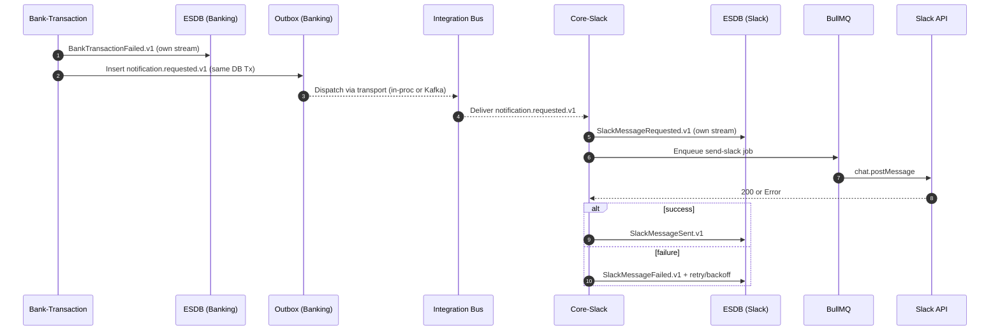

# COPILOT_INSTRUCTIONS.md

> **Purpose:** Teach GitHub Copilot how to propose code and patterns that match this repository’s architecture: a **module monolith** using **DDD + CQRS**, **EventStoreDB** for domain persistence, **Outbox** for reliability, optional **Kafka** for inter‑BC messaging, and **BullMQ** for async jobs. The key deliverable is an **Integration Bus abstraction** so modules publish/consume integration events without caring about the transport.

---

## 1) Golden Rules Copilot Must Follow

1. **Do not couple modules.** A module writes only **its own domain events** to its **own ESDB streams**. Never write Slack domain events from Banking, etc.
2. **Use the Integration Bus port** for cross‑module communication. Do not import “other module” services directly.
3. **Use Outbox** for durable publishing alongside the domain write. If the transport is in‑process now, keep the Outbox contract anyway to allow future Kafka.
4. **Idempotency is mandatory.** Consumers must dedupe by `idempotencyKey` (often derived from `correlationId + tenantId + logicalKey`).
5. **Traceability.** Every event includes `eventId`, `correlationId`, `tenantId`, and `occurredAt`. Log these at producer and consumer.
6. **Config via DI.** Bind the bus with Nest providers (e.g. `InProcessBus` in dev, `OutboxBus` in prod). Never new‑up adapters in business code.
7. **Separation of event types:**

   - **Domain events:** private to a module, persisted in that module’s ESDB stream.
   - **Integration events:** public contracts emitted/consumed across modules via the bus.

---

## 2) Repo Conventions

### Language & Runtime

- **TypeScript**, **NestJS**, Node.js **>= 18**.
- Prefer `async/await`, no callbacks. Keep functions pure where feasible.

### Directory Structure (suggested)

```
src/
  shared/
    integration/
      integration-event.ts
      integration-bus.port.ts
      transports/
        inprocess-transport.adapter.ts
        kafka-transport.adapter.ts
      adapters/
        inprocess-bus.adapter.ts
        outbox-bus.adapter.ts
      dispatcher/
        outbox-dispatcher.worker.ts
    outbox/
      outbox.entity.ts
      outbox.repository.ts
  banking-transaction/
    application/
      use-cases/
      commands/
      events/        # domain events
    infrastructure/
      repositories/
    presentation/
  core-slack/
    application/
      handlers/      # subscribes to integration events via bus
      use-cases/
    domain/
      aggregates/
      events/        # Slack domain events
    infrastructure/
      esdb/
      queue/         # BullMQ
```

### Naming

- Integration event type: `{namespace}.{entity}.{action}.v{n}`

  - Examples: `notification.requested.v1`, `slack.message.sent.v1`.

- ESDB stream names: `{module}.{entity}-{id}`

  - Examples: `banking.transaction-{txnId}`, `slack.message-{messageId}`.

---

## 3) Integration Bus Port & Event Contract

Create a stable envelope for integration events and a bus port with pluggable transports.

```ts
// src/shared/integration/integration-event.ts
export interface IntegrationEvent<T = unknown> {
  type: string; // e.g. "notification.requested.v1"
  version: number; // schema version
  eventId: string; // uuid
  correlationId?: string;
  tenantId?: string;
  idempotencyKey?: string; // producer-provided key for dedupe
  occurredAt: string; // ISO timestamp
  payload: T; // typed per event
  headers?: Record<string, string>;
}
```

```ts
// src/shared/integration/integration-bus.port.ts
export interface PublishOptions {
  key?: string; // partition/routing key
  delayMs?: number; // optional delay
}

export interface IntegrationBus {
  publish<T>(event: IntegrationEvent<T>, opts?: PublishOptions): Promise<void>;
  subscribe(
    type: string,
    handler: (evt: IntegrationEvent) => Promise<void>,
  ): void;
}
```

### In‑Process Bus (Monolith/Dev)

```ts
// src/shared/integration/adapters/inprocess-bus.adapter.ts
import { Subject } from 'rxjs';
import { IntegrationBus, PublishOptions } from '../integration-bus.port';
import { IntegrationEvent } from '../integration-event';

export class InProcessBus implements IntegrationBus {
  private readonly subject = new Subject<IntegrationEvent>();

  async publish(event: IntegrationEvent, _opts?: PublishOptions) {
    this.subject.next(event);
  }

  subscribe(type: string, handler: (evt: IntegrationEvent) => Promise<void>) {
    this.subject.subscribe((e) => {
      if (e.type === type) void handler(e);
    });
  }
}
```

### Outbox Bus (Durable Publishing)

```ts
// src/shared/integration/adapters/outbox-bus.adapter.ts
import { IntegrationBus, PublishOptions } from '../integration-bus.port';
import { IntegrationEvent } from '../integration-event';
import { OutboxRepository } from '../../outbox/outbox.repository';

export class OutboxBus implements IntegrationBus {
  constructor(private readonly repo: OutboxRepository) {}

  async publish(event: IntegrationEvent, opts?: PublishOptions): Promise<void> {
    await this.repo.add(event, opts); // must be saved within the same Tx as the domain change
  }

  subscribe(): void {
    /* Not used here. Subscriptions handled by transport/consumers. */
  }
}
```

> The **dispatcher** reads `outbox` rows and forwards to the configured **Transport**:

```ts
// src/shared/integration/transports/transport.port.ts
import { IntegrationEvent } from '../integration-event';
import { PublishOptions } from '../integration-bus.port';

export interface Transport {
  send(event: IntegrationEvent, opts?: PublishOptions): Promise<void>;
}
```

---

## 4) Banking → Slack Example (What Copilot Should Generate)

**Producer (Banking):** On transaction failure, publish a notification request.

```ts
// banking-transaction/application/use-cases/notify-on-failure.usecase.ts
await this.integrationBus.publish(
  {
    type: 'notification.requested.v1',
    version: 1,
    eventId: crypto.randomUUID(),
    correlationId,
    tenantId,
    idempotencyKey: `txn:${txnId}:slack:${templateCode}`,
    occurredAt: new Date().toISOString(),
    payload: {
      channel: 'slack',
      configCode: 'alerts',
      templateCode: 'txn-failed',
      data: { txnId, amount, reason },
    },
  },
  { key: tenantId ?? 'default' },
);
```

**Consumer (Core‑Slack):** Subscribe, persist Slack domain events, enqueue job.

```ts
// core-slack/application/handlers/notification-requested.handler.ts
this.integrationBus.subscribe('notification.requested.v1', async (evt) => {
  if (evt.payload?.channel !== 'slack') return;

  // 1) Persist SlackMessageRequested.v1 in Slack ESDB
  await this.slackMessageRepo.appendRequested({
    messageId: this.idGen(),
    correlationId: evt.correlationId,
    tenantId: evt.tenantId,
    templateCode: evt.payload.templateCode,
    payload: evt.payload.data,
    occurredAt: evt.occurredAt,
  });

  // 2) Enqueue BullMQ job (idempotent by idempotencyKey)
  await this.queue.add('send-slack', {
    idempotencyKey: evt.idempotencyKey,
    messagePayload: evt.payload,
  });
});
```

**Worker:** render + call Slack API; append `Sent`/`Failed` events.

```ts
// core-slack/infrastructure/queue/slack.worker.ts
try {
  const result = await this.slackApi.chatPostMessage(rendered);
  await this.slackMessageRepo.appendSent({ messageId, ts: result.ts });
} catch (err) {
  await this.slackMessageRepo.appendFailed({ messageId, reason: String(err) });
  // retry per policy/backoff; DLQ on max attempts
}
```

---

## 5) Mermaid: End‑to‑End Flow (for docs and PRs)



---

## 6) Wiring in NestJS (Examples Copilot Should Propose)

```ts
// src/shared/integration/integration.module.ts
import { Module } from '@nestjs/common';
import { InProcessBus } from './adapters/inprocess-bus.adapter';

@Module({
  providers: [
    { provide: 'IntegrationBus', useClass: InProcessBus }, // swap to OutboxBus in prod
  ],
  exports: ['IntegrationBus'],
})
export class IntegrationModule {}
```

```ts
// banking-transaction/banking-transaction.module.ts
@Module({
  imports: [IntegrationModule],
  providers: [NotifyOnFailureUseCase],
})
export class BankingTransactionModule {}
```

```ts
// core-slack/core-slack.module.ts
@Module({
  imports: [IntegrationModule],
  providers: [NotificationRequestedHandler, SlackQueue, SlackMessageRepository],
})
export class CoreSlackModule {}
```

---

## 7) Outbox Details Copilot Must Respect

- **Atomicity:** Insert outbox rows in the **same transaction** as the domain change.
- **Dispatcher:** Runs out‑of‑band (BullMQ/cron). Reads undelivered rows → `transport.send()` → marks delivered; exponential backoff on transient errors.
- **Schema:**

  - `outbox(id, type, payload, headers, occurred_at, idempotency_key, tenant_id, correlation_id, status, attempts)`

- **Idempotent send:** Transport should protect against duplicates (e.g., Kafka producer with a deterministic key).

---

## 8) Consumer Idempotency Pattern

On each integration handler:

- Compute a **dedupe key** = `evt.idempotencyKey || evt.eventId` + `tenantId`.
- Check a **processed table/cache** before acting. If already processed → **return**.
- After successful side‑effects, **record** the key with a TTL (or forever for critical actions).

---

## 9) Observability & Logging

- Always log: `eventId`, `correlationId`, `tenantId`, `type`, `attempt`, and the worker/job id.
- Propagate `correlationId` to downstream logs (HTTP headers, job data, event metadata).

---

## 10) Security & Data Hygiene

- Never place secrets/tokens in event payloads.
- Respect tenant isolation; include `tenantId` in topic keys/partitions.
- Keep payloads **minimal** (templateCode + data). Heavy rendering happens in the consumer.

---

## 11) What **Not** To Do (Copilot, please avoid)

- ❌ Banking writing directly to Slack ESDB.
- ❌ Calling Slack API from the Banking module.
- ❌ Bypassing the bus by importing another module’s services.
- ❌ Emitting integration events **without** Outbox (unless explicitly in in‑memory dev mode).

---

## 12) Quick Prompts (to steer Copilot)

- “Generate a NestJS `IntegrationBus` port and an `InProcessBus` adapter using RxJS Subject.”
- “Create an `OutboxRepository` with `add()`, `markSent()` and a BullMQ dispatcher that calls a `Transport` port.”
- “Write a handler in `core-slack` that subscribes to `notification.requested.v1`, persists `SlackMessageRequested.v1`, and enqueues a BullMQ job.”
- “Add idempotency to the consumer using a repository `hasProcessed(key)` and `markProcessed(key)`.”

---

## 13) PR Acceptance Checklist

- [ ] Producer publishes via `IntegrationBus` (no direct coupling).
- [ ] Outbox row is written in the same Tx as the domain event/state change.
- [ ] Consumer is idempotent by key and logs correlation fields.
- [ ] ESDB writes stay within module boundaries.
- [ ] Tests cover happy path + duplicate delivery + transient transport error.

---

## 14) Glossary

- **Domain event:** Internal, persisted in module ESDB; not a cross‑module contract.
- **Integration event:** Public contract carried by the Integration Bus.
- **Outbox:** Durable buffer table to ensure at‑least‑once delivery out of a DB transaction.
- **Transport:** Actual delivery mechanism (in‑proc, Kafka, etc.).

---

_This document is the authoritative guide for Copilot suggestions in this codebase. Keep module boundaries clean, publish via the bus, and prefer durable patterns by default._
